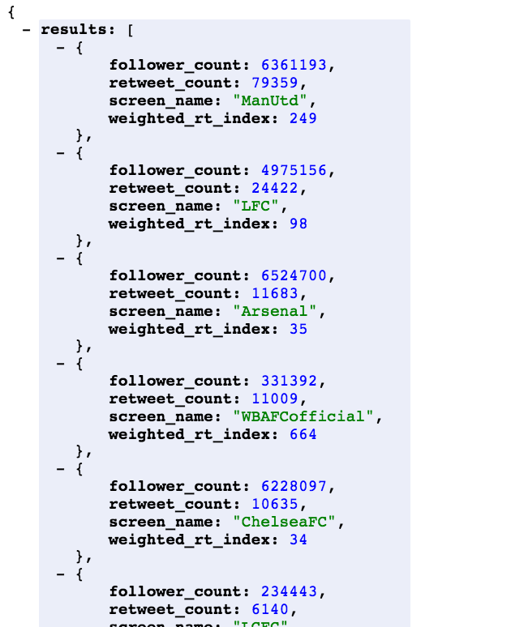
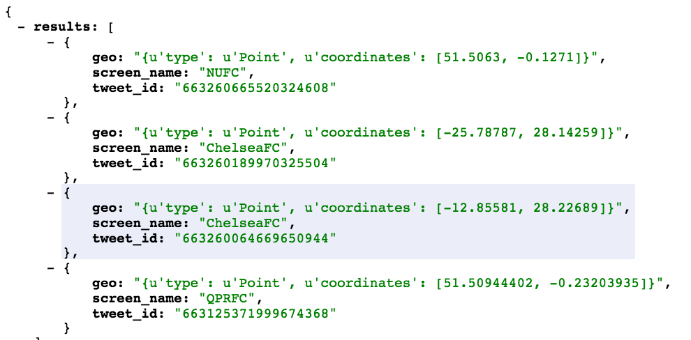

# Tweet_factory

### Instalación
Todo debería estar en el requirements.txt

### Ejecución

El puerto por defaulr es el 5000.

Para la primera ejecución tienen que crear la base de datos poniendo en un shell de python en consola:
```sh
$ from tweet_factory import init_db
$ init_db()
```

Para ejecutar normalmente:
```sh
$ python tweet_factory.py
```

Dada la baja proporción de tweets geolocalizados y los límites del API de Twitter no es fácil conseguir un volumen importante de tweets geolocalizados. Un thread se queda recogiendo todos los tweets geolocalizados que sea posible encontrar. Dejen ejecutando el programa para tener tweets en la base de datos local.

### API

/metrics 

.

weighted_rt_index es una aproximación al porcentaje de seguidores que le han dado retweets a los últimos tweets de una cuenta. Yo creo que la podemos usar como métrica social. 

/geo

.

